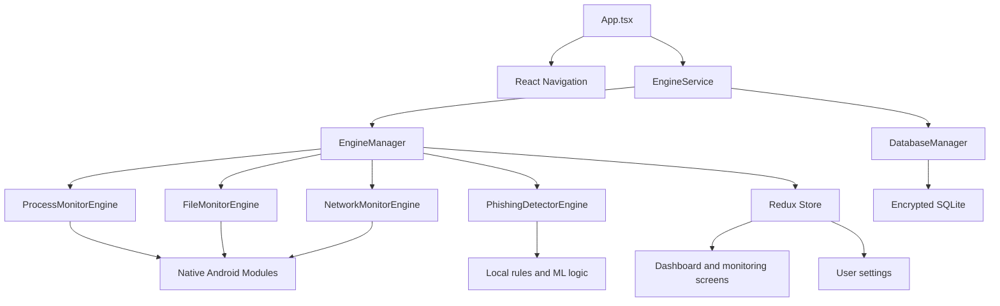
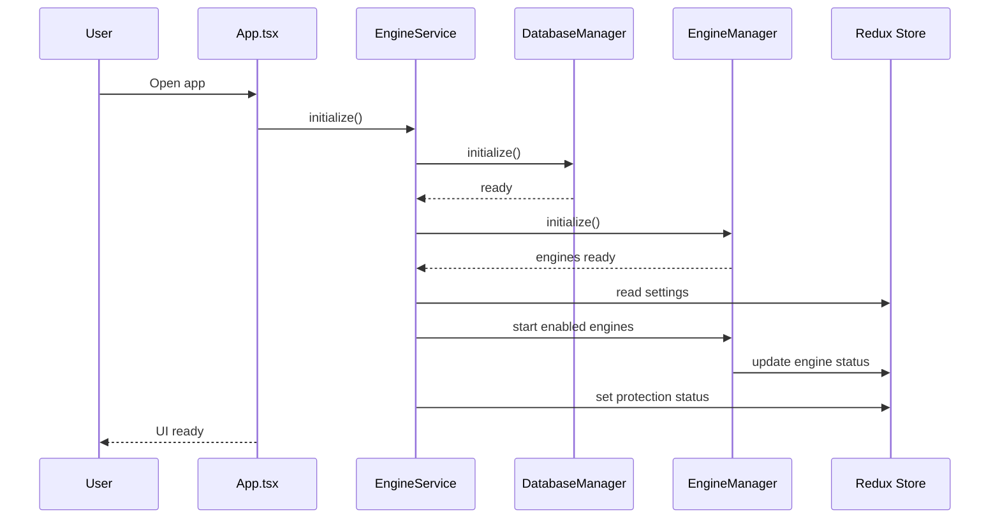
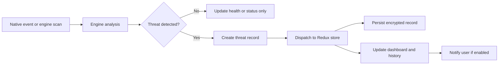

# CyberDefense Mobile Architecture and Workflow

## Purpose

This document explains how the mobile application is structured, how data moves through the system, and how the runtime workflow is coordinated from app launch to threat detection and user response.

The project is a React Native security application with native Android integrations, Redux state management, an encrypted local database, and multiple detection engines that can be enabled independently from settings.

## System Overview

The application is organized around four layers:

1. Presentation layer: React Native screens and navigation.
2. Coordination layer: service classes that start, stop, and synchronize engines.
3. Detection layer: process, file, network, and phishing engines.
4. Data layer: Redux store, encrypted SQLite storage, and secure local key storage.

At runtime, the app launches the UI, initializes local persistence, loads the security engines, and starts only the monitors that are enabled in the user's settings.

## High-Level Architecture

## Repository Structure

The root project is a React Native app, with the main implementation concentrated in `src/`:

- `src/ui/`: screens and UI composition.
- `src/services/`: orchestration services such as `EngineService`.
- `src/engine/`: security engines and engine interfaces.
- `src/database/`: encrypted database access.
- `src/store/`: Redux store configuration and slices.
- `src/native/`: React Native bridge definitions.
- `src/types/`: shared TypeScript types.
- `src/utils/`: constants and helpers.

The Android-specific native code is kept under `android/` and `native/android/`.

## Core Runtime Components

### App Entry Point

`App.tsx` is the application root. On startup it:

- mounts the Redux provider;
- configures navigation;
- initializes `EngineService` in a `useEffect` hook;
- updates the status bar styling;
- shuts down services on unmount.

The root navigator exposes the main dashboard tabs plus the sandbox analysis screen.

### EngineService

`EngineService` is the top-level bootstrapper for security services. Its responsibilities are:

- initialize the encrypted database;
- initialize all registered engines;
- read current monitoring settings from Redux;
- start only the enabled engines;
- update protection status in the store;
- stop everything during shutdown.

This service is the gate between app launch and the security runtime.

### EngineManager

`EngineManager` owns the engine registry and lifecycle coordination. It currently registers:

- process monitoring;
- file monitoring;
- network monitoring;
- phishing detection.

It performs three key jobs:

- initialize each engine;
- start or stop engines based on current settings;
- publish engine status back into Redux.

The manager is intentionally the only place that knows how to start the full engine set together.

### Redux Store

The Redux store is the shared runtime state for the UI and the engines. It contains:

- threats state;
- system health and protection status;
- user settings;
- process data.

The store lets background engine activity drive the UI without direct coupling between screens and native modules.

### DatabaseManager

`DatabaseManager` owns local persistence. The app uses an encrypted SQLite database for sensitive records such as threats, processes, and network events. Sensitive keys and configuration values are kept in encrypted storage.

## Detection Engines

### ProcessMonitorEngine

This engine tracks process-level activity and suspicious execution patterns. It is responsible for:

- discovering running processes;
- comparing them with expected baselines;
- measuring resource usage;
- identifying unusual or hidden activity;
- generating threat records when risk thresholds are exceeded.

The engine is a good candidate for native Android integration because process visibility and low-level telemetry are platform-specific.

### FileMonitorEngine

This engine watches for risky file events and suspicious package or APK-related behavior. Its role is to:

- observe file changes;
- analyze suspicious installs or modifications;
- raise alerts for file-system based threats.

### NetworkMonitorEngine

This engine handles network inspection and exfiltration-related detection. It is expected to:

- intercept traffic through the Android VPN path;
- inspect DNS and connection behavior;
- identify beaconing or suspicious transfers;
- create alerts when traffic matches a threat pattern.

### PhishingDetectorEngine

This engine evaluates URLs and domain characteristics. It combines rule-based checks and local inference-style logic to detect phishing and lookalike domains.

## Native Android Bridge

The app uses native Android modules for platform-sensitive tasks that React Native cannot do alone.

Expected bridge responsibilities include:

- process enumeration;
- file watching;
- VPN-backed network monitoring;
- delivery of native events into JavaScript.

The bridge keeps device-level access close to the operating system while preserving the React Native UI and application logic in TypeScript.

## Data Flow

### Startup Workflow

### Threat Detection Workflow

### User Interaction Workflow

1. The user opens the dashboard and sees the current protection state.
2. The user changes a setting that enables or disables an engine.
3. Redux updates the settings slice.
4. The next engine lifecycle action reads those settings.
5. `EngineManager` starts or stops the affected engine.
6. The store and UI reflect the new monitoring state.

## Security and Privacy Model

The application is designed around local-first security.

- Processing stays on device.
- Threat records are encrypted before persistence.
- Sensitive runtime keys are stored locally.
- The app avoids cloud synchronization for core security data.

This model is important because security telemetry can be highly sensitive and should not leave the device unless the user explicitly opts into a future sync flow.

## UI Workflow

The navigation model is intentionally simple:

- Dashboard: overall security posture and summary metrics.
- Live Monitor: live detection state and active engine status.
- Network: network-related telemetry and alerts.
- History: stored threat timeline.
- Settings: engine toggles and app preferences.
- Sandbox Analysis: isolated inspection path for suspicious samples or URLs.

The UI is driven by the Redux store, so changes in the engine layer propagate naturally to the screens.

## Development Workflow

### Local Development

1. Install dependencies with `npm install`.
2. Start the Metro bundler with `npm run start` or `npm run dev`.
3. Launch the app on Android with `npm run android`.
4. Run type checking with `npm run type-check`.
5. Run linting with `npm run lint`.
6. Run tests with `npm test`.

### Change Flow

For typical feature work, the usual path is:

1. Update or add the relevant engine or service.
2. Adjust the Redux slice if the UI state changes.
3. Add or update the screen that renders the new state.
4. Verify the native bridge if platform access is needed.
5. Validate with type checking and linting before release.

### Release Safety Checklist

- Confirm no secrets are present in the tree.
- Confirm build artifacts are ignored.
- Verify the app starts cleanly after a fresh install.
- Ensure only intended engine settings are enabled by default.
- Confirm encrypted storage is still used for sensitive data.

## Operational Notes

- `EngineService` should remain the single bootstrap path for security runtime startup.
- `EngineManager` should remain the single coordinator for engine lifecycle transitions.
- The store should continue to be the UI-facing source of truth.
- Native modules should only expose the minimum platform-specific API needed by the engines.

## Summary

The application is a layered mobile security system: React Native handles the interface, Redux holds the shared state, `EngineService` and `EngineManager` control the runtime, native Android code provides device-level access, and encrypted local storage preserves sensitive data. The workflow is startup, initialize, detect, persist, and reflect back into the UI.